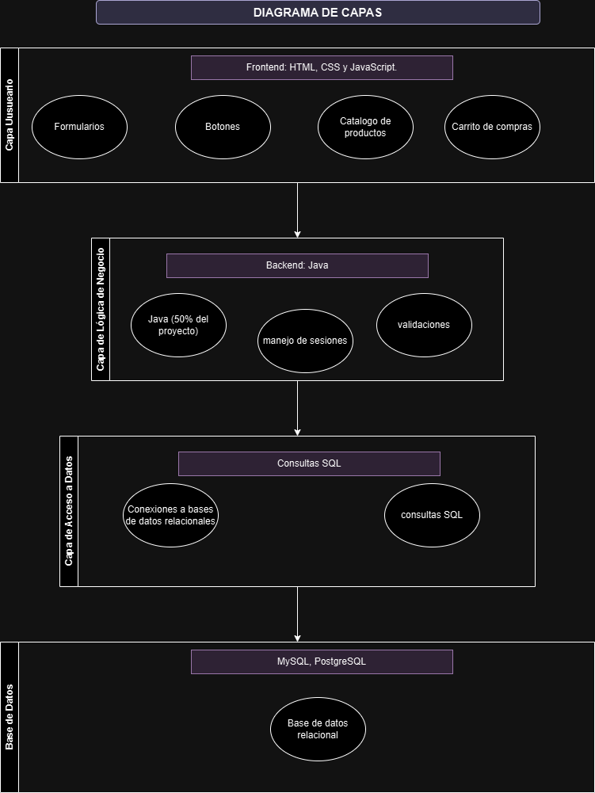
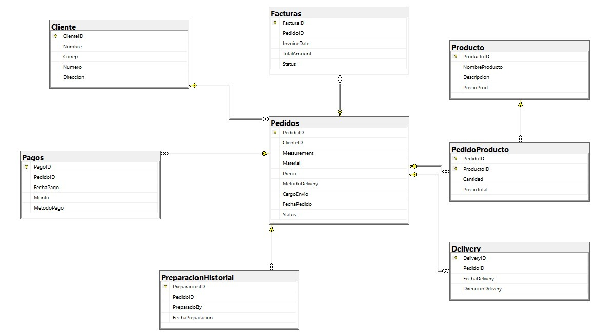

# Diseño de una aplicacion web para la empresa Pizarras Elenita
 
1\. **Introducción:**  
   *Objetivo:*

1. Objetivo General

      > Desarrollo de un aplicativo web para la automatización de venta en línea y gestión de catálogo para la empresa Pizarras Elenita. 

2. *Objetivos Específicos*   
* Implementar un sistema de gestión de usuarios que permita a los administradores y clientes de Pizarras Elenita acceder al aplicativo web al
  igual que permitir el registro de usuarios nuevos.  
* Diseñar una interfaz intuitiva y fácil de usar que permita a los usuarios realizar pedidos de productos de manera eficiente, con opciones de
  búsqueda y filtrado para encontrar rápidamente los productos deseados.  
* Integrar un sistema de carrito de compras que permita a los administradores agregar, modificar y eliminar productos antes de confirmar sus
  pedidos, con la capacidad de guardar carritos para compras futuras.

  *Alcance:*

- Sistema de gestión de usuarios: Desarrollar un sistema de gestión de usuarios que permita la creación de cuentas para administradores y clientes.  
- Catálogo de productos: Crear un catálogo en línea que muestre todos los productos disponibles en el inventario de Pizarras Acrílicas, con
- descripciones detalladas, imágenes y precios actualizados.  
- Carrito de compras: Implementar un sistema de carrito de compras que permita a los usuarios agregar productos, modificar cantidades y eliminar
- artículos antes de finalizar sus pedidos.  
- Proceso de compra: Desarrollar un proceso de compra fluido y seguro que incluya pasos para seleccionar productos, ingresar información de envío
-  y facturación, y confirmar los pedidos.

    *Contexto:*  
> El mercado objetivo de la aplicación web de venta de pizarras está compuesto principalmente por estudiantes, profesores, oficinas, pequeños negocios
y aficionados a la planificación y organización visual. Este segmento incluye tanto usuarios individuales como corporativos que buscan pizarras para
uso personal, educativo y profesional, con una demanda constante a lo largo del año debido a las necesidades de planificación y
comunicación en diversos entornos.

> En cuanto a los competidores, la empresa se enfrenta a tiendas físicas tradicionales y plataformas de comercio electrónico que
también ofrecen pizarras y materiales de oficina, como Amazon, Staples y Office Depot. Sin embargo, nuestra propuesta se diferencia
al centrarnos en una experiencia personalizada, simplificada y con una interfaz amigable, diseñada para facilitar la búsqueda y
compra de productos especializados, garantizando al mismo tiempo una gestión eficiente del inventario y un servicio al cliente de alta calidad.

2\.  **Requisitos:**  
   2.1 *Requerimientos funcionales*

1. *Gestión de Usuarios:*

   \- Registro de nuevos usuarios.

   \- Inicio de sesión con autenticación segura (correo y contraseña).

   \- Recuperación de contraseña (mediante correo electrónico).

   \- Gestión de perfiles de usuario (actualización de información personal, foto de perfil).

   \- Asignación de roles (administrador, usuario estándar).

2. *Catálogo de Productos:*

   \- Visualización de productos con detalles (nombre, descripción, precio, imágenes).

   \- Filtros de búsqueda y categorías (por tipo de pizarra, precio, disponibilidad).

   \- Comparación de productos.

   \- Valoración y comentarios de productos por parte de los usuarios.

3. *Carrito de Compras:*

   \- Añadir y eliminar productos del carrito.

   \- Actualización de la cantidad de productos en el carrito.

   \- Visualización del resumen del carrito con precios totales.

   \- Aplicación de cupones o descuentos.

   \- Proceso de pago (checkout).

4. *Procesamiento de Pagos:*

   \- Integración con pasarelas de pago (PayPal, tarjetas de crédito/débito).

   \- Confirmación y notificación de pagos exitosos.

   \- Generación de facturas electrónicas y recibos.

5. *Gestión de Pedidos:*

   \- Visualización del historial de pedidos.

   \- Seguimiento de pedidos en tiempo real (estado del pedido, número de seguimiento).

   \- Cancelación de pedidos antes de la confirmación del envío.

   \- Notificaciones por correo electrónico para actualizaciones de estado de pedidos.

6. *Panel de Administración:*

   \- Gestión de productos (añadir, editar, eliminar).

   \- Gestión de usuarios y roles.

   \- Visualización y gestión de pedidos.

   \- Generación de reportes (ventas, usuarios, productos más vendidos).

   \- Configuración del sitio (política de privacidad, términos y condiciones).

7. *Soporte y Contacto:*

   \- Formulario de contacto.

   \- Chat en vivo para soporte.

   \- Sección de preguntas frecuentes (FAQ).

   \- Sistema de tickets para incidencias o consultas.

2.2  *Requerimientos no funcionales*

1. *Seguridad:*

   \- Autenticación y autorización seguras.

   \- Encriptación de datos sensibles (contraseñas, información de pago).

2. *Rendimiento:*

   \- Respuesta del servidor en menos de un minuto para la mayoría de las solicitudes.

   \- Soporte para un alto número de usuarios concurrentes.

   \- Carga rápida de páginas e imágenes.

3. *Usabilidad:*

   \- Diseño responsivo para dispositivos móviles y tabletas.

   \- Interfaz de usuario intuitiva y fácil de navegar.

   \- Cumplimiento de estándares de accesibilidad (WCAG 2.1).

4. *Mantenimiento:*

   \- Facilidad para actualizar y mantener el código.

   \- Registro de errores y monitoreo continuo.

   \- Documentación detallada del código y la arquitectura.

5. *Disponibilidad y Confiabilidad:*

   \- Tasa de disponibilidad del 99.9%.

   \- Copias de seguridad diarias automáticas.

6. *Compatibilidad:*

   \- Soporte para navegadores modernos (Chrome, Firefox, Safari, Edge).

   \- Compatibilidad con diferentes sistemas operativos.

   **Diagramas de casos de uso:  Visualizar la interacción entre los usuarios y el sistema.**

3\.  Diseño:  
   * Diagrama de capas:
     
   
   * Diagrama de clases:
     
   
  
4\.  **Desarrollo:**  
 *Tecnologías:*

* Backend: Java, manejando la lógica de negocio, autenticación y gestión de API.  
* Base de Datos: MySQL o Oracle para almacenamiento de datos.  

  

  

